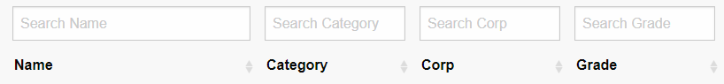
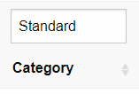
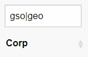
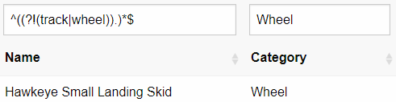

# TerraTech Block List

Browser based table to display up-to-date and accurate (mod-exported) properties for blocks in TerraTech game.

Latest Release: [Block List v0.1.4](https://danny-alexander.github.io/terratech-block-list/block-list.html)

## Current features

### Expandable details


### Sorting

Hold shift to sort by a 2nd column.


### Filtering

Using javascript regular expressions.

#### Global filter


#### Individual Column filter



Display only standard blocks.



Separate (OR) alternative matches with ```|``` e.g ```gso|geo``` to show only GSO or GeoCorp blocks.



Blocks in Wheel blocks that don't have ```track``` or ```wheel``` in their name.
I [looked this one up](https://stackoverflow.com/questions/6449131/javascript-regular-expression-to-not-match-a-word): ```^((?!(track|wheel)).)*$```



## Planned features

### Recipe and raw cost columns

### Function specific properties

e.g Speed and movement stats for wheels, propellers, damage stats for guns etc.

This will require updating the mod which exports the information we have, ideally in a more easily query-able json format.

## Links

[GitKraken Glo board - planning etc](https://app.gitkraken.com/glo/board/XVD-R2R-2QAPHQed)

[Report a bug or suggest a feature](https://github.com/Danny-Alexander/terratech-block-list/issues/new/choose)

Please feel free to help out cleaning up code, working on any of the [outstanding issues](https://github.com/Danny-Alexander/terratech-block-list/issues). 

All negative and positive feedback is welcome - I've been winging this one for the most part from the get-go having almost no prior experience with html, jquery, datatables, setting up GitHub projects, GitKraken integration etc.
