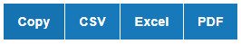
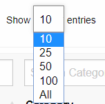
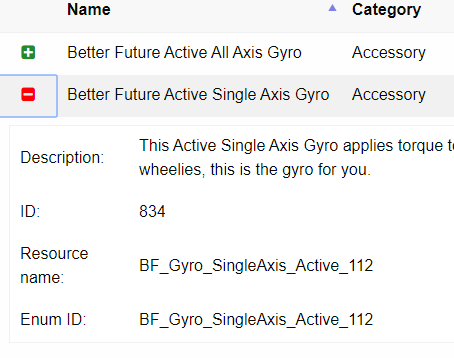

# TerraTech Block List

Browser based table to display up-to-date and accurate (mod-exported) properties for blocks in TerraTech game.

## Web page: [Block List v0.1.5](https://danny-alexander.github.io/terratech-block-list/block-list.html)

[GitKraken Glo board - planning etc](https://app.gitkraken.com/glo/board/XVD-R2R-2QAPHQed)

[Report a bug or suggest a feature](https://github.com/Danny-Alexander/terratech-block-list/issues/new/choose)

Check out the [outstanding issues](https://github.com/Danny-Alexander/terratech-block-list/issues) if you'd like to help - any is welcome.

## Current features

### Show/hide columns

### Save or copy the data

Copy/export into a spreadsheet (includes hidden columns). This is like flattening the json data file.

### Sorting

Hold shift to sort by a 2nd column.

### Global filter

### Specify how many rows to display.

### Expandable details (WIP)

## Planned features

### Recipe and raw cost columns

### Function specific properties

e.g Speed and movement stats for wheels, propellers, damage stats for guns etc.

## Feedback

Both negative and positive is welcome - I've been winging this one for the most part from the get-go having almost no prior experience with html, jquery, DataTables, setting up GitHub projects, GitKraken integration etc.

## Notes

I wish I'd done this using Vue framework now and am tempted to put time into setting it up with that instead.
